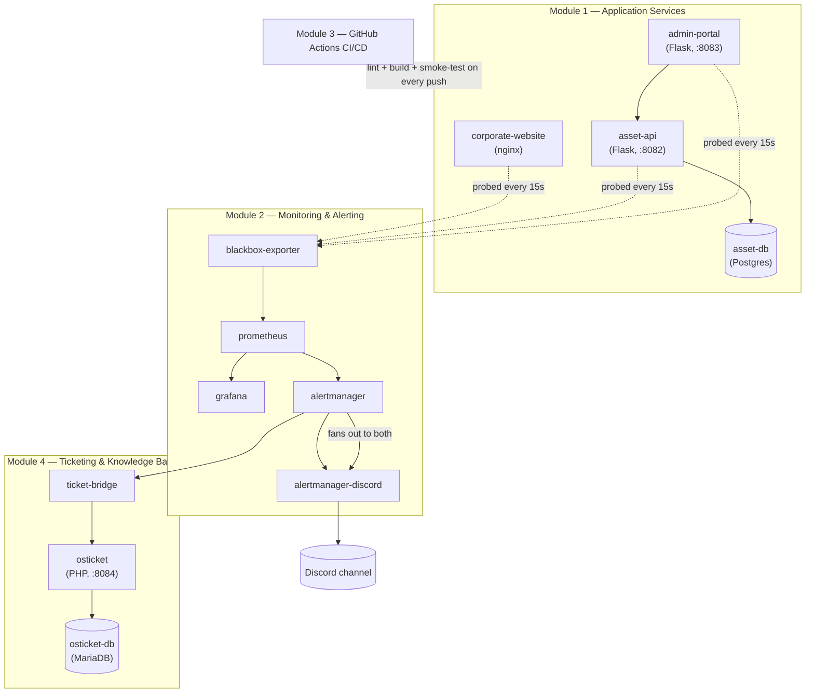

# IT Ops & Support Simulation Lab

A self-contained IT infrastructure simulation built to practice the daily workflow
of an IT Support / NOC / Junior SysAdmin role: services running in containers,
monitoring and alerting on top of them, an incident-to-ticket flow, and a CI/CD
pipeline that gates changes before they reach the "production" stack.

This is a learning/portfolio project, built solo with AI assistance.

## Scenario

**NovaTech Solutions** is a fictional small IT services company. Its stack:

| Service | Role | Port | Tech |
|---|---|---|---|
| `corporate-website` | Public marketing site | 8081 | nginx + static HTML |
| `asset-api` | Internal REST API for IT asset inventory (laptops, printers, phones...) | 8082 | Python/Flask + PostgreSQL |
| `admin-portal` | Internal dashboard used by IT staff to view/manage assets | 8083 | Python/Flask (server-rendered) |
| `asset-db` | Database backing the asset API | internal only | PostgreSQL 16 |
| `osticket` | Ticketing system agents use to track and resolve incidents | 8084 | osTicket (PHP) + MariaDB |
| `ticket-bridge` | Turns firing Alertmanager alerts into osTicket tickets | internal only | Python/Flask |

`admin-portal` calls `asset-api`, which reads/writes `asset-db`. `corporate-website`
is fully independent. This gives three distinct HTTP endpoints to monitor, plus a
realistic failure mode (API up but DB down, API down but website fine, etc.).

## Architecture



All application/monitoring/ticketing services share one Docker bridge network
(`lab`); only the ports in the table above are published to the host. Blackbox
Exporter is the only thing that talks to the three app services over HTTP —
Prometheus talks to Blackbox Exporter, never to the apps directly.

## Status

- [x] Module 1 — Services & Docker Compose foundation
- [x] Module 2 — Monitoring & Alerting (Prometheus, Blackbox Exporter, Grafana, Alertmanager)
- [x] Module 3 — CI/CD (GitHub Actions)
- [x] Module 4 — Ticketing & Support (incident → ticket → resolution, Knowledge Base)
- [x] Module 5 — Documentation (architecture diagram, demo walkthrough, incident report)

## Running locally

```bash
docker compose up --build
```

| URL | Service |
|---|---|
| http://localhost:8081 | Corporate website |
| http://localhost:8082/health | Asset API health check |
| http://localhost:8082/api/assets | Asset API (JSON) |
| http://localhost:8083 | Admin portal (dashboard UI) |
| http://localhost:9090 | Prometheus |
| http://localhost:9115 | Blackbox Exporter |
| http://localhost:9093 | Alertmanager |
| http://localhost:3001 | Grafana (login: `admin` / `admin`) |
| http://localhost:8084 | osTicket (agent login at `/scp/`) |

> Grafana is published on **3001**, not the usual 3000, to avoid clashing with a
> locally installed Grafana on this machine. Adjust in `docker-compose.yml` if
> that's not an issue on your system.

To get real Discord notifications on incidents, copy `.env.example` to `.env`
and set `DISCORD_WEBHOOK_URL` to a webhook URL from your Discord server
(Server Settings → Integrations → Webhooks → New Webhook). Without it,
`alertmanager-discord` will keep restarting — harmless, the rest of the stack
still works, alerts just won't be delivered anywhere.

osTicket auto-installs on first boot using `OSTICKET_ADMIN_EMAIL` /
`OSTICKET_ADMIN_PASSWORD` from `.env` (defaults in `.env.example` work fine for
a local demo). It will force a password change on first login — that's
osTicket's own behavior, not something this repo controls. **Auto-ticketing
from Alertmanager needs one manual one-time step** because it depends on
values osTicket only generates after install — see
[Ticketing & Knowledge Base (Module 4)](#ticketing--knowledge-base-module-4)
below.

Stop everything:

```bash
docker compose down
```

Reset the database (drops all data):

```bash
docker compose down -v
```

## Architecture (Module 1)

```
                 ┌────────────────────┐
   Internet ───▶ │ corporate-website  │  (nginx, static)
                 └────────────────────┘

                 ┌────────────────────┐      ┌──────────────┐
   Internet ───▶ │   admin-portal     │ ───▶ │  asset-api   │ ───▶ asset-db (Postgres)
                 │  (Flask, port 8083)│      │ (Flask, 8082)│
                 └────────────────────┘      └──────────────┘
```

All services share a single Docker bridge network (`lab`) so they can reach each
other by service name. Only the app-facing ports are published to the host;
`asset-db` is reachable only from within the network.

## Monitoring & alerting (Module 2)

```
 corporate-website ┐
 asset-api/health  ├──▶ blackbox-exporter ──▶ prometheus ──▶ alertmanager ──▶ alertmanager-discord ──▶ Discord
 admin-portal      ┘                              │
                                                    ▼
                                                 grafana (dashboards)
```

- **Blackbox Exporter** performs an HTTP GET against each service every 15s
  (`corporate-website:/`, `asset-api:/health`, `admin-portal:/`) and exposes
  `probe_success` / `probe_duration_seconds`.
- **Prometheus** scrapes those metrics and evaluates two alert rules
  (`monitoring/prometheus/alert.rules.yml`):
  - `ServiceDown` — `probe_success == 0` for 30s
  - `ServiceSlowResponse` — `probe_duration_seconds > 1` for 1m
- **Grafana** (pre-provisioned, no manual setup) shows a "Service Uptime &
  Response Time" dashboard: per-service UP/DOWN stat panels, a response-time
  graph, and an uptime timeline.
- **Alertmanager** routes firing alerts to `alertmanager-discord`, which
  translates them into a Discord message.

Tested end-to-end by stopping `corporate-website` (`docker stop corporate-website`):
the Grafana panel flipped to DOWN within 15s, and `ServiceDown` reached
Alertmanager within the 30s `for` window. Restarting the container auto-resolved
the alert.

## CI/CD (Module 3)

GitHub Actions workflow: [`.github/workflows/ci.yml`](.github/workflows/ci.yml).
Runs on every push and pull request to `main`:

1. **lint** — `ruff` static analysis on `asset-api` and `admin-portal`.
2. **build-and-test** (only if lint passes) — builds all three application
   images via `docker compose build`, starts the stack, polls each service
   until reachable, then asserts on the actual response of `/`, `/health`,
   and `/api/assets`. Logs are dumped on failure; containers are always torn
   down afterward.

Scope note: there's no real production server to deploy to, so "CD" here
stops at build + smoke-test rather than an actual deployment step — that's a
deliberate boundary, not a missing piece.

## Ticketing & Knowledge Base (Module 4)

```
prometheus ─▶ alertmanager ─┬─▶ alertmanager-discord ─▶ Discord
                              └─▶ ticket-bridge ─▶ osTicket API ─▶ osticket (+ osticket-db)
```

Alertmanager's route fans every alert out to **two** receivers at once
(`monitoring/alertmanager/alertmanager.yml`): `discord` (Module 2) and a new
`ticketing` receiver pointed at `ticket-bridge`. `ticket-bridge`
(`services/ticket-bridge/app.py`) is a small Flask service that:

- accepts Alertmanager's webhook POST at `/alert`,
- on a **firing** alert it hasn't seen before, calls osTicket's REST API
  (`POST /api/tickets.json`) to open a ticket with the alert's summary and
  description as the ticket body,
- on **resolved**, clears its own bookkeeping so a later re-firing of the
  same alert can open a fresh ticket. (It doesn't auto-close the osTicket
  ticket — closing means confirming the fix, which is a human judgment call,
  same as the incident flow in the project brief: alert → ticket → operator
  investigates → resolves → documents in KB.)
- keeps an in-memory map of alert fingerprint → ticket number so a
  still-firing alert (Alertmanager re-sends every `repeat_interval`, 1h)
  doesn't open a new ticket every hour. This resets if the container
  restarts — acceptable for a lab, not something you'd ship to production
  without a persistent store.

**osTicket itself is PHP + MariaDB**, not part of the Python stack, using the
[`rinkp/osticket-dockerized`](https://hub.docker.com/r/rinkp/osticket-dockerized)
image because it supports a fully automated install via environment variables
(no manual click-through setup wizard) — `osticket-tls` generates a
self-signed cert so MariaDB can require TLS, matching how the upstream project
recommends running it.

### Manual one-time setup (required for auto-ticketing to work)

osTicket's REST API keys are restricted by source IP, and that IP doesn't
exist until the container is actually running — so this can't be baked into
the image or `.env` up front. `ticket-bridge` is pinned to a **static IP**
(`172.28.0.50`, via the `lab` network's fixed `172.28.0.0/16` subnet in
`docker-compose.yml`) specifically so this only has to be done once:

1. Start the stack, log into osTicket at http://localhost:8084/scp/ with
   `OSTICKET_ADMIN_EMAIL` / `OSTICKET_ADMIN_PASSWORD` (you'll be forced to set
   a new password on first login).
2. **Admin Panel → Manage → API → Add New API Key**: IP Address
   `172.28.0.50`, check "Can Create Tickets", save.
3. Copy the generated key into `.env` as `OSTICKET_API_KEY`, then
   `docker compose up -d ticket-bridge` to pick it up.
4. **Admin Panel → Emails → Settings → uncheck "Verify email address
   domain"**, then Save. osTicket validates the *sender* email's domain via a
   real DNS lookup by default; the monitoring sender address
   (`monitoring@novatech.example`) uses a reserved documentation-only domain
   ([RFC 2606](https://www.rfc-editor.org/rfc/rfc2606)) that will never
   resolve, so ticket creation fails with `Incomplete client information`
   until this is off. (Found by reading osTicket's own source in the running
   container — `include/class.ticket.php` and `class.validator.php` — after
   the error message alone didn't say which field was the problem.)

Verified end-to-end by stopping `admin-portal`: the alert reached
`ticket-bridge` and a real ticket appeared in osTicket
(`[CRITICAL] admin-portal is down`, with the same description text Prometheus
generated), which was then closed with an internal note documenting the root
cause after restarting the container.

### Knowledge Base

Two FAQ articles under the "Incident Runbooks" category
(Knowledgebase → FAQs in the osTicket admin panel), written from the actual
alert rules in `monitoring/prometheus/alert.rules.yml`:

- **"ServiceDown alert fired - what do I do?"** — check Grafana, check
  container status/logs, restart, confirm recovery, close the ticket.
- **"ServiceSlowResponse alert - service is up but slow"** — check response
  time trend, check `asset-db` load if it's `asset-api`, decide whether it's
  a transient spike or needs a restart.

## Documentation (Module 5)

- **[Demo walkthrough](docs/demo-walkthrough.md)** — a screenshot-by-screenshot
  walk through one real incident, captured live off this exact stack: healthy
  baseline → `corporate-website` stopped → Grafana flips to DOWN → osTicket
  ticket auto-created with Prometheus's own alert text → service restarted →
  Grafana recovers → ticket closed with a resolution note.
- **[Incident report](docs/incident-report.md)** — the same run, written up
  in the format an IT support/NOC team would actually use: timeline, root
  cause, impact, resolution, and follow-up.
- Architecture diagram — see [Architecture](#architecture) above.

This closes out the project as scoped in the original brief: containerized
services, monitoring/alerting, CI/CD, an incident-to-ticket workflow with a
Knowledge Base, and documentation of all of it.
