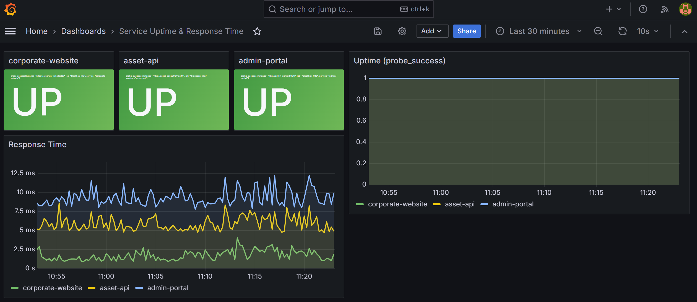
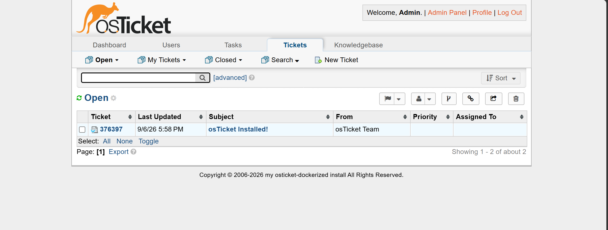
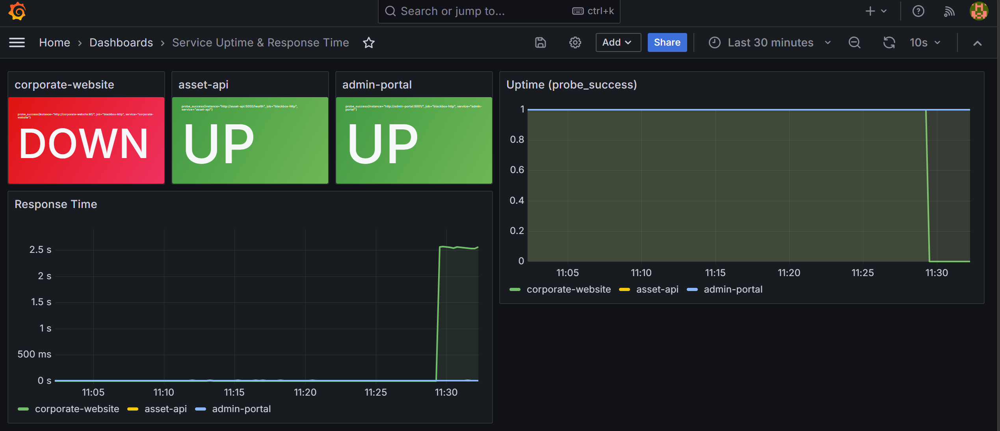
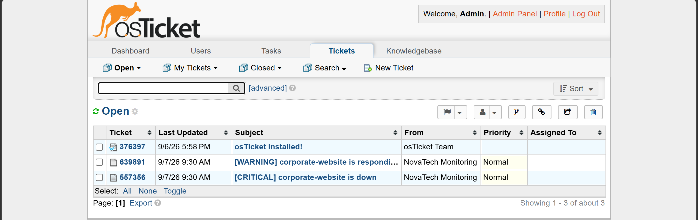
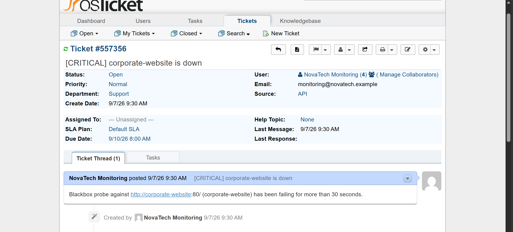
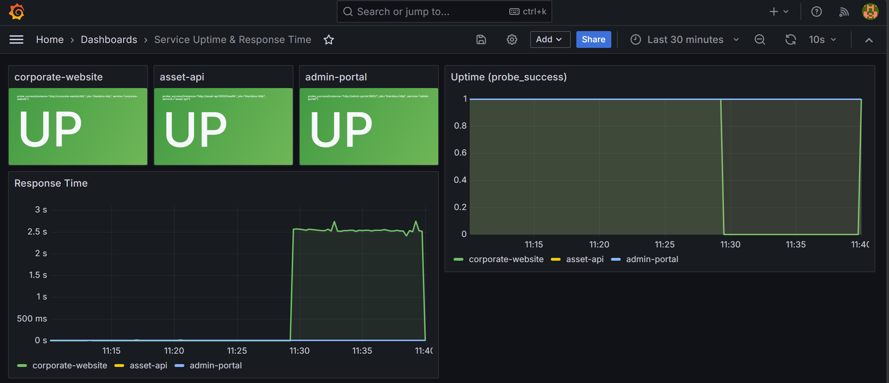
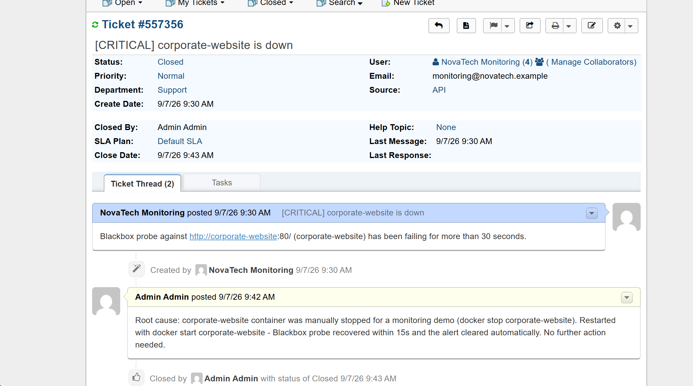

# Demo Walkthrough

A live incident, captured screenshot-by-screenshot on this exact stack running
locally. Nothing here is staged after the fact — every screenshot below was
taken in the moment while the incident was actually happening.

**What's being demonstrated:** the full incident-to-resolution loop from the
project brief — a service goes down, monitoring detects it, a ticket is
created automatically, someone investigates and fixes it, and the fix is
documented before closing the ticket.

## 1. Baseline — everything healthy

All three application services respond, and osTicket's queue is essentially
empty (just the default "osTicket Installed!" welcome ticket).





## 2. Incident triggered

`corporate-website` is stopped to simulate an outage:

```bash
docker stop corporate-website
```

Blackbox Exporter probes every 15 seconds, so Grafana reflects the outage
almost immediately — well before Prometheus's `ServiceDown` rule has even
finished its 30-second `for` window and starts notifying anyone.



## 3. Alert fires → ticket appears automatically

Once `probe_success == 0` has held for 30 seconds, Prometheus's alert goes
from `pending` to `firing` and Alertmanager dispatches it to **both** configured
receivers at once: Discord, and `ticket-bridge`, which calls osTicket's REST
API to open a ticket. No human touched osTicket to create this — it showed up
on its own, seconds after the outage crossed the alert threshold.



The ticket body is exactly the description text Prometheus generated for the
alert — nothing was retyped or summarized by a person:



## 4. Fix applied

```bash
docker start corporate-website
```

Grafana's uptime graph shows the exact moment of recovery — the outage window
and the instant return to green are both visible on the same timeline:



## 5. Document and close

The alert clears itself in Prometheus once the service is healthy again — but
the *ticket* stays open until a person confirms the fix and writes down why it
happened. That's deliberate: an outage clearing on its own doesn't mean anyone
learned anything from it. Closing it here with the actual root cause is what
makes the ticket worth having:



## What this proves

- Blackbox Exporter → Prometheus → Grafana: outage visible in the dashboard
  within ~15 seconds.
- Prometheus → Alertmanager → ticket-bridge → osTicket: a real support ticket
  exists within ~30-40 seconds of the outage starting, with no manual step.
- The same alert also reached Discord at the same time (see
  [README → Monitoring & alerting](../README.md#monitoring--alerting-module-2)).
- Nothing auto-closes: a human still has to confirm the fix and write down
  what happened, same as a real support workflow.

See [`incident-report.md`](incident-report.md) for the same run written up as
a formal incident report.
